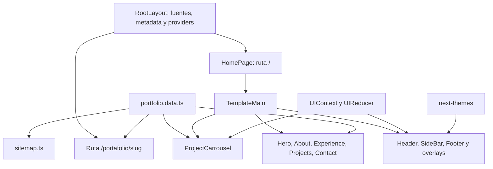

# Visión general del proyecto

**Última revisión:** 2026-09-15.

## Propósito y alcance

El repositorio implementa el portafolio personal de Joan Cochachi. La página principal presenta el perfil profesional, habilidades, experiencia, proyectos y contacto. La interfaz visible se orienta a WordPress y PHP, aunque la metadata global todavía utiliza el posicionamiento anterior de Front End Developer / Freelancer.

Es una aplicación Next.js 14.1.0 con React 18 y TypeScript. No hay una API de negocio, base de datos, CMS, autenticación ni formulario de envío implementados en este repositorio. Las menciones a WordPress, WooCommerce, Stripe, Mailchimp y otras plataformas describen trabajos del portafolio; no son integraciones ejecutadas por esta aplicación.

## Mapa de carpetas

```text
my-portfolio/
├── src/
│   ├── app/
│   │   ├── layout.tsx, globals.scss, favicon.ico
│   │   ├── robots.ts, sitemap.ts
│   │   └── (pages)/
│   │       ├── page.tsx                  → /
│   │       ├── home/
│   │       │   ├── _components/          → secciones y UI del portafolio
│   │       │   ├── _data/                → contenido local
│   │       │   └── _domain/              → interfaces TypeScript
│   │       └── portafolio/[slug]/page.tsx
│   ├── shared/                          → plantilla, UI, hooks y configuración
│   └── store/                           → Context activo y esqueletos de estado
├── public/                              → imágenes y PDFs accesibles por URL
├── tests/                               → pruebas del destino de proyectos con Node.js
├── docs/
│   ├── arquitectura/                    → documentación técnica viva
│   ├── case-studies/                    → contenido editorial de seis casos
│   ├── superpowers/plans/               → plan de esta entrega documental
│   └── portfolio-audit-and-plan.md       → auditoría y checkpoints anteriores
├── AGENTS.md                            → instrucciones de mantenimiento
└── archivos de dependencias y configuración
```

`(pages)` agrupa rutas sin aparecer en la URL. `home` no contiene `page.tsx`: no existe una página `/home`. Las carpetas privadas `_components`, `_data` y `_domain` organizan el módulo.

## Flujo de renderizado y datos



Las páginas y secciones sin `use client` parten del modelo de componentes de servidor de App Router. `TemplateMain`, `ProjectItem`, los providers y los controles interactivos delimitan partes cliente. Un archivo sin `use client` también puede incorporarse al cliente si lo importa un componente cliente; por ejemplo, el carrusel se importa desde `TemplateMain`.

Los componentes reciben contenido de los arrays locales. La interacción modifica Context en memoria; no guarda proyectos en un servidor. El tema se delega a `next-themes`.

## Dependencias entre áreas

- La home compone la plantilla compartida y las secciones específicas.
- `shared/components/template/TemplateMain.tsx` importa el carrusel de la home: la plantilla compartida tiene una dependencia concreta del portafolio.
- La ruta de detalle y el sitemap importan los mismos datos que la home.
- Las interfaces tipan los datos durante desarrollo. `project-view.ts` valida la configuración mínima del destino y las dimensiones de la captura antes de mostrar enlaces.
- Los `index.ts` reexportan símbolos para simplificar imports; no constituyen capas de servicios adicionales.

## Límites principales observados

- Hay 17 proyectos: seis casos destacados y once proyectos anteriores. Quince tienen slug interno.
- Los datos de los casos incluyen textos extensos, pero la ruta de detalle solo renderiza una imagen.
- Siete experiencias están definidas; el agrupamiento actual solo muestra las primeras seis.
- El estado Redux, un provider global y un reducer global son esqueletos sin uso funcional.
- Hay pruebas automatizadas del destino de proyectos en `tests/project-view.test.cjs`, ejecutables con Node.js y la dependencia TypeScript local. No hay una auditoría integral de rendimiento o accesibilidad.

Fuentes principales: [página principal](../../src/app/(pages)/page.tsx), [layout](../../src/app/layout.tsx), [datos](../../src/app/(pages)/home/_data/portfolio.data.ts), [package.json](../../package.json). Los detalles y sus escenarios se distribuyen en las guías siguientes.
